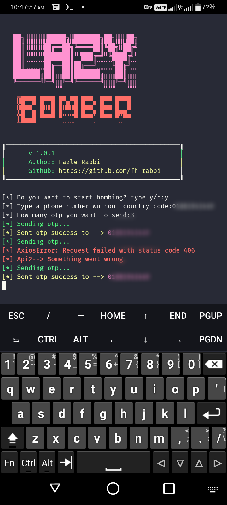

<a href="#"><h1 align="center">Lazy-Bomber</h1></a>

## Usages:

* `pkg install git`
* `pkg install nodejs`
* `git clone https://github.com/fh-rabbi/Lazy-Bomber`
* `cd Lazy-Bomber`
* `npm start`

## Size: `Only 2 MB`

## Tested On:
* `Termux`

## Screenshot:
